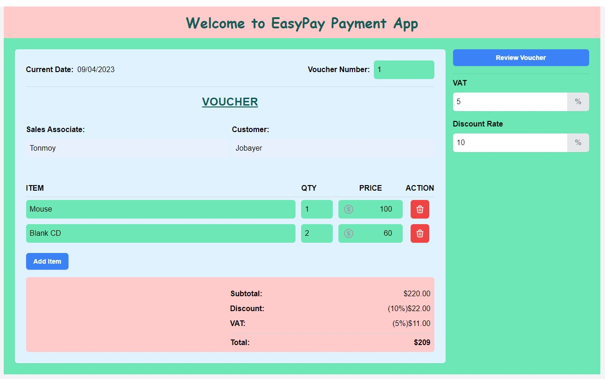
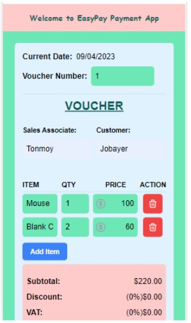
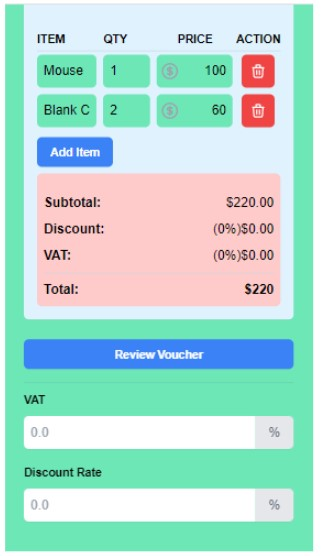
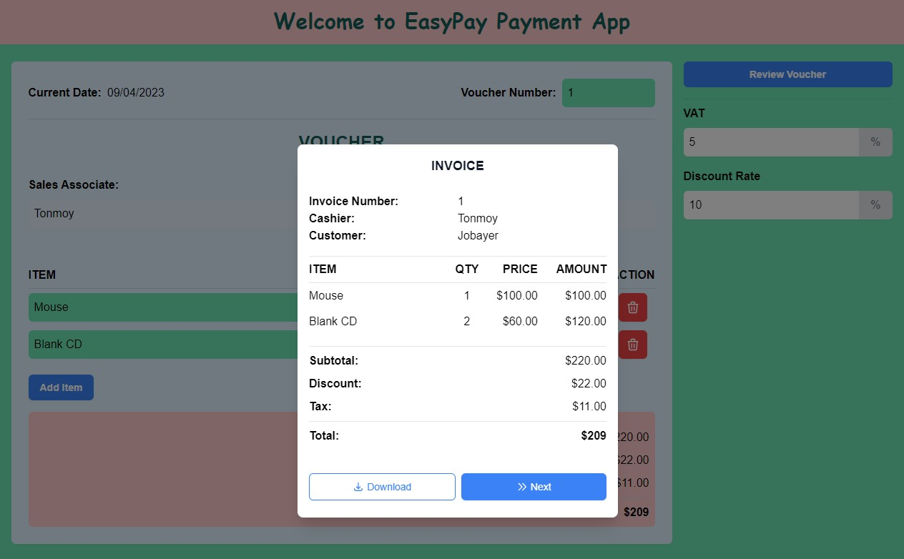

---

# Easypay Payment App


### This voucher app built with React.js and Tailwind CSS is a web application that allows users to create and manage invoices. The app features a user-friendly interface that enables users to create new invoices, view existing ones, and delete invoices as needed. Users can input customer name, items, quantities, and prices, and the app calculates the total cost automatically.The app also includes features like the ability to generate PDFs of invoices

<br/>

Site Link: [EasyPay Payment App](https://darling-praline-de2a42.netlify.app/)

### To Run this app:

<html>
  <head> </head>
  <body></body>
</html>

```javascript
npm create vite@latest
npm install -D tailwindcss postcss autoprefixer
npx tailwindcss init -p
```

<br/>

<br/>


<!--  -->






<br/>


<!-- all link is here -->

[websitelink]: http://www.studywithanis.com
[facebooklink]: https://www.facebook.com/studywithanis

